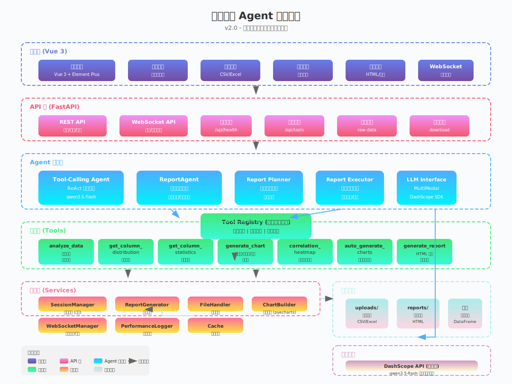
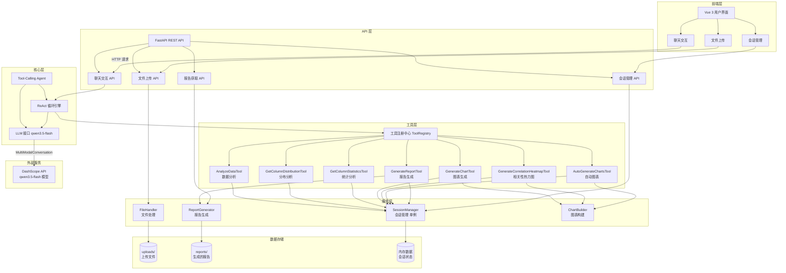

# 报告生成 Agent 应用

智能数据分析与报告生成系统，支持上传 CSV/Excel 文件，通过多轮对话进行数据分析，自动生成 HTML 格式报告。

**当前版本：** v2.0 - 新增 WebSocket 流式响应、智能报告生成 Agent、性能日志

## 功能特性

- 📊 **多会话管理** - 支持创建多个独立会话，数据隔离
- 📁 **文件上传** - 支持 CSV、Excel 文件（包括多 sheet 页）
- 🤖 **AI 智能分析** - 基于 qwen3.5-flash 模型理解分析需求
- 📈 **数据可视化** - 自动生成柱状图、折线图、饼图、散点图、热力图等
- 📋 **HTML 报告** - 生成美观的数据分析报告，支持查看和下载
- 💬 **多轮对话** - 通过对话形式逐步深入分析数据
- ⚡ **流式响应** - WebSocket 流式输出，实时显示 AI 回复
- 🔔 **实时推送** - WebSocket 推送报告生成进度
- 🧠 **智能报告** - ReportAgent 自主规划报告结构和内容
- 📝 **性能日志** - 内置性能追踪，记录 API 响应时间

## 系统架构图





## 架构说明

### Tool-Calling Agent 架构（v2.0 核心）

本系统采用 **Tool-Calling Agent** 架构，基于 ReAct 模式（Reason + Act）循环：

1. **用户输入** → 接收分析需求
2. **LLM 推理** → 决定是否需要调用工具
3. **工具执行** → 执行数据分析、图表生成等工具
4. **结果反馈** → 将工具结果反馈给 LLM
5. **生成回复** → 生成最终回复给用户

**v2.0 新增特性：**
- **流式响应** - 使用 `ai_agent.run_streaming()` 实时推送 AI 回复
- **ReportAgent** - 独立的智能报告生成 Agent，支持异步生成和进度推送
- **性能日志** - 内置性能追踪，记录每个环节的执行时间
- **WebSocket 管理** - 统一的 WebSocket 连接管理，支持按 session_id 分组广播

```
┌─────────────┐     ┌──────────────────┐     ┌─────────────┐
│   用户界面   │ ──→ │ Tool-Calling Agent│ ──→ │   LLM(qwen)  │
│  (Vue 3)    │ ←── │  (ReAct 循环)     │ ←── │  (推理决策)  │
└─────────────┘     └──────────────────┘     └─────────────┘
                            │
                            ↓
                    ┌───────────────┐
                    │   工具注册中心  │
                    │  (ToolRegistry)│
                    └───────────────┘
                            │
        ┌───────────────────┼───────────────────┐
        ↓                   ↓                   ↓
┌───────────────┐   ┌───────────────┐   ┌───────────────┐
│  数据分析工具  │   │  图表生成工具  │   │  报告生成工具  │
└───────────────┘   └───────────────┘   └───────────────┘
```

### 可用工具列表

| 工具名称 | 描述 |
|----------|------|
| `analyze_data` | 分析数据文件，返回基础统计信息和数据质量评估 |
| `get_column_distribution` | 获取某一列的数据分布情况 |
| `get_column_statistics` | 获取某列的详细统计信息（均值、中位数等） |
| `generate_chart` | 生成柱状图、折线图、饼图、散点图 |
| `generate_correlation_heatmap` | 生成变量相关性热力图 |
| `auto_generate_charts` | 根据数据特征自动生成合适的图表 |
| `generate_report` | 生成完整的 HTML 格式数据分析报告 |

## 项目结构

```
f:\report_gen/
├── backend/
│   ├── main.py                  # FastAPI 应用入口
│   ├── config.py                # 配置文件（上传目录、AI 模型配置等）
│   ├── models/
│   │   ├── __init__.py
│   │   ├── report.py            # 报告数据模型
│   │   └── schemas.py           # Pydantic 数据模型
│   ├── services/
│   │   ├── __init__.py
│   │   └── session_manager.py   # 会话管理（单例模式）
│   ├── utils/
│   │   ├── __init__.py
│   │   ├── cache.py             # 缓存工具
│   │   ├── chart_builder.py     # 图表构建器
│   │   ├── file_handler.py      # 文件上传处理
│   │   └── performance_logger.py # 性能日志
│   ├── agents/
│   │   ├── __init__.py
│   │   ├── base.py              # Agent 基类
│   │   ├── registry.py          # 工具注册中心（单例）
│   │   ├── report_agent.py      # 智能报告生成 Agent
│   │   ├── report_executor.py   # 报告执行引擎
│   │   ├── report_planner.py    # 报告规划器
│   │   └── tool_calling.py      # Tool-Calling Agent（核心 AI 逻辑）
│   ├── tools/
│   │   ├── __init__.py
│   │   ├── base.py              # 工具基类
│   │   ├── chart_tools.py       # 图表生成工具
│   │   ├── data_tools.py        # 数据分析工具
│   │   └── report_tools.py      # 报告生成工具
│   └── websocket_manager.py     # WebSocket 管理器（实时推送）
├── frontend/
│   ├── src/
│   │   ├── App.vue              # Vue 3 主界面
│   │   ├── main.js              # 入口文件
│   │   └── api/
│   │       └── client.js        # API 客户端
│   ├── package.json
│   └── vite.config.js
├── uploads/                     # 上传文件存储目录
├── reports/                     # 生成的报告存储目录
├── .env.example                 # 环境变量模板
├── .gitignore
├── kill_services.bat            # Windows 服务终止脚本
├── requirements.txt             # Python 依赖
└── README.md
```

## 快速开始

### 1. 安装后端依赖

```bash
cd f:\report_gen
pip install -r requirements.txt
```

### 2. 配置 API 密钥

复制 `.env.example` 为 `.env` 并填写你的 DashScope API 密钥：

```bash
cp .env.example .env
```

编辑 `.env` 文件，填入从 [DashScope 控制台](https://dashscope.console.aliyun.com/apiKey) 获取的 API 密钥。

### 3. 启动后端服务

```bash
# 在 f:\report_gen 目录下
python -m uvicorn backend.main:app --reload --host 0.0.0.0 --port 8000
```

后端服务将在 http://localhost:8000 启动

API 文档地址：http://localhost:8000/docs

### 4. 安装前端依赖

```bash
cd frontend
npm install
```

### 5. 启动前端开发服务器

```bash
npm run dev
```

前端服务将在 http://localhost:3000 启动

## 使用说明

1. **创建会话** - 点击"新建会话"按钮创建一个新的分析会话
2. **上传文件** - 拖拽或点击上传 CSV/Excel 数据文件
3. **输入需求** - 在对话框中输入分析需求，如：
   - "分析销售数据趋势"
   - "各地区的销售对比"
   - "找出异常值和数据质量问题"
4. **查看报告** - 点击"查看报告"按钮查看 HTML 格式分析报告
5. **下载报告** - 点击"下载报告"按钮下载报告文件

## API 接口

### REST API

| 方法 | 路径 | 描述 |
|------|------|------|
| POST | /api/sessions | 创建新会话 |
| GET | /api/sessions | 获取会话列表 |
| GET | /api/sessions/{id} | 获取会话详情 |
| DELETE | /api/sessions/{id} | 删除会话 |
| POST | /api/sessions/{id}/upload | 上传文件 |
| GET | /api/sessions/{id}/report | 获取报告 |
| GET | /api/reports/{id} | 查看报告 |
| GET | /api/reports/{id}/download | 下载报告 |
| GET | /api/charts/{chart_id}/raw-data | 获取图表原始数据 |
| GET | /api/tools | 获取可用工具列表 |
| GET | /api/health | 健康检查 |

### WebSocket API

| 端点 | 描述 |
|------|------|
| `/ws/progress/{session_id}` | 接收报告生成进度通知 |
| `/api/sessions/{session_id}/chat/stream?message={msg}` | 流式聊天接口，实时推送 AI 回复（推荐使用） |

## 技术栈

**后端:**
- Python 3.10+
- FastAPI >=0.115.0
- pandas >=2.2.0 / numpy >=1.26.0
- pyecharts >=2.0.1（可视化）
- dashscope >=1.20.0（阿里通义千问 SDK，使用 qwen3.5-flash 模型）
- openpyxl >=3.1.2（Excel 处理）
- python-dotenv >=1.0.0
- aiofiles >=23.2.1
- websockets >=12.0（WebSocket 支持）
- pydantic >=2.0.0（数据验证）

**前端:**
- Vue 3 >=3.4.0
- Vue Router >=4.2.0
- Element Plus >=2.5.0
- Axios >=1.6.0
- Vite >=5.0.0

## 注意事项

- 文件大小限制：10MB
- 支持的文件格式：.csv, .xlsx, .xls
- 多 sheet 页 Excel 文件会自动读取所有 sheet 数据
- AI 会根据用户需求智能判断分析策略（分开或整合多 sheet 页）
- WebSocket 连接用于实时推送，前端需要建立 WebSocket 连接接收进度
- 流式聊天超时时间设置为 300 秒（5 分钟），报告生成可能需要较长时间

## 开发说明

### 添加新的分析工具

1. 在 `backend/tools/` 目录下创建新的工具文件
2. 继承 `BaseTool` 基类，实现 `definition` 和 `execute` 方法
3. 在 `backend/main.py` 中注册新工具

### 自定义报告样式

编辑 `backend/agents/report_agent.py` 修改 HTML 报告生成逻辑

### 扩展图表类型

编辑 `backend/utils/chart_builder.py` 添加新的图表生成逻辑

### 修改 Agent 行为

编辑 `backend/agents/tool_calling.py` 调整系统提示词或工具调用逻辑

### WebSocket 消息格式

**进度通知消息：**
```json
{
  "type": "progress",
  "data": {
    "stage": "planning" | "executing" | "generating" | "complete" | "error",
    "message": "人类可读的进度描述",
    "progress": 0-100 的整数，
    "chapter": "当前章节名称（可选）",
    "report_id": "生成的报告 ID（完成时）"
  }
}
```

**流式聊天消息：**
```json
{
  "type": "chat_start" | "chat_chunk" | "chat_complete" | "error",
  "data": {
    "text": "文本片段（chat_chunk 时）",
    "response": "完整回复（chat_complete 时）",
    "report_url": "报告 URL（如有）",
    "message": "错误消息（error 时）"
  }
}
```

### 性能日志

使用 `performance_logger.py` 追踪 API 请求性能：

```python
from backend.utils.performance_logger import get_perf_logger, track_performance

perf = get_perf_logger()
perf.reset()
perf.start("operation_name")
# ... 执行操作 ...
perf.end("operation_name")
print(perf.summary())
```

## License

MIT
